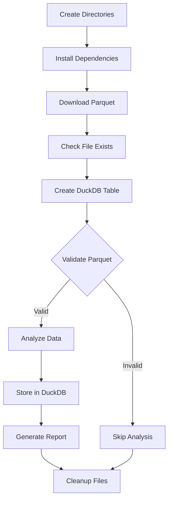

# Advanced ETL Pipeline with Airflow & DuckDB

This project demonstrates an advanced ETL pipeline using Apache Airflow to process NYC Yellow Taxi data. The pipeline downloads, validates, analyzes, and stores data using DuckDB, and generates a Markdown report.

## Features

- Automated data download from NYC Yellow Taxi public datasets
- Data validation and schema checks
- Data analysis (vendor distribution, passenger stats, trip distance, fare stats)
- Results storage in DuckDB (local file-based database)
- Markdown report generation
- Modular, production-ready Airflow DAG

## Architecture



**Pipeline Steps:**

- Create required directories
- Install Python dependencies
- Download NYC Yellow Taxi Parquet data
- Validate file existence
- Create DuckDB table for analysis results
- Validate Parquet schema and data
- Analyze data (if valid)
- Store results in DuckDB
- Generate a Markdown report
- Cleanup temporary files

---

## Getting Started

### Prerequisites

- Python 3.8+
- Apache Airflow package
- Internet access for data download

### Setup

1. **Clone the repository:**

   ```sh
   git clone https://github.com/yourusername/Airflow-Dag-Scripts.git
   cd Airflow-Dag-Scripts/Example_11_Advanced_ETL_DuckDB_Pipeline
   ```
2. **Install dependencies (if not using Airflow's dynamic install):**

   ```sh
   pip install pandas pyarrow duckdb
   ```
3. **Configure Airflow:**

   - Place `code.py` in your Airflow DAGs folder.
   - Ensure the Airflow scheduler and webserver are running.
4. **Run the DAG:**

   - Trigger the DAG named `EXAMPLE_11_Advanced_ETL_DuckDB_Pipeline` from the Airflow UI.

### Output

- **DuckDB Database:** `~/airflow/data/taxi_analysis.db`
- **Analysis Summary:** `~/airflow/data/taxi_summary.json`
- **Markdown Report:** `~/airflow/data/taxi_report.md`
- **Processing Log:** `~/airflow/data/taxi_processing.log`

## Example Report

The pipeline generates a Markdown report with key statistics, vendor distribution, and summary insights.

## References

- [NYC Taxi &amp; Limousine Commission Data](https://www.nyc.gov/site/tlc/about/tlc-trip-record-data.page)
- [DuckDB Documentation](https://duckdb.org/docs/)
- [Apache Airflow Documentation](https://airflow.apache.org/docs/)
