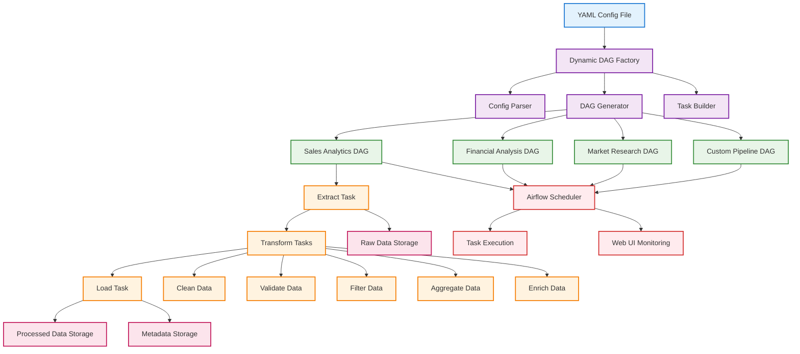

# 🚀 Dynamic DAG Factory for Apache Airflow

**Production-ready Dynamic DAG Factory** that creates multiple Apache Airflow DAGs from a single YAML configuration file using the Factory Design Pattern. Enables scalable, maintainable, and configuration-driven data pipeline orchestration.

## 📋 Table of Contents

* [Overview](https://claude.ai/chat/57a40f58-1baf-45a7-a505-563103f7e66e#overview)
* [Architecture](https://claude.ai/chat/57a40f58-1baf-45a7-a505-563103f7e66e#architecture)
* [Features](https://claude.ai/chat/57a40f58-1baf-45a7-a505-563103f7e66e#features)
* [Quick Start](https://claude.ai/chat/57a40f58-1baf-45a7-a505-563103f7e66e#quick-start)
* [Configuration](https://claude.ai/chat/57a40f58-1baf-45a7-a505-563103f7e66e#configuration)
* [Usage Examples](https://claude.ai/chat/57a40f58-1baf-45a7-a505-563103f7e66e#usage-examples)
* [Project Structure](https://claude.ai/chat/57a40f58-1baf-45a7-a505-563103f7e66e#project-structure)
* [Technical Implementation](https://claude.ai/chat/57a40f58-1baf-45a7-a505-563103f7e66e#technical-implementation)
* [Best Practices](https://claude.ai/chat/57a40f58-1baf-45a7-a505-563103f7e66e#best-practices)
* [Contributing](https://claude.ai/chat/57a40f58-1baf-45a7-a505-563103f7e66e#contributing)

---

## 🎯 Overview

The **Dynamic DAG Factory** is an enterprise-grade solution that demonstrates advanced Apache Airflow concepts and Python design patterns. It automatically generates multiple DAGs from declarative YAML configurations, enabling teams to scale data pipeline development efficiently while maintaining code quality and consistency.

### Business Value

* **Reduced Development Time** : Create new pipelines through configuration, not code
* **Consistency** : Standardized pipeline patterns across all data workflows
* **Maintainability** : Single codebase manages multiple pipeline definitions
* **Scalability** : Add new pipelines without touching the core implementation

### Technical Excellence

* **Factory Design Pattern** : Clean separation of concerns and extensible architecture
* **Configuration-Driven** : YAML-based pipeline definitions for non-technical users
* **Error Handling** : Comprehensive exception management and graceful degradation
* **Data Serialization** : Robust handling of complex data types and JSON serialization
* **Professional Logging** : Structured logging with emojis for enhanced readability

---

## 🏗️ Architecture



## ✨ Features

### 🎨 **Dynamic DAG Generation**

* Create unlimited DAGs from a single Python file
* Factory Pattern implementation for clean, maintainable code
* Runtime DAG discovery through `globals()` registration

### 📝 **Configuration-Driven Development**

* YAML-based pipeline definitions
* No-code pipeline creation for non-technical users
* Version-controlled configuration management

### 🔄 **Comprehensive Data Transformations**

* **Extract** : HTTP data source ingestion with error handling
* **Clean** : Data standardization, null removal, type optimization
* **Validate** : Schema validation, data quality checks
* **Filter** : Conditional data filtering with date/time support
* **Aggregate** : Statistical operations with grouping capabilities
* **Enrich** : Metadata augmentation and calculated fields

### 🛡️ **Production-Ready Features**

* Robust error handling and graceful failure recovery
* JSON serialization handling for complex data types
* Comprehensive logging with structured output
* Data lineage tracking and metadata preservation
* File system organization with pipeline isolation

### 📊 **Monitoring & Observability**

* Detailed execution statistics and metrics
* Processing metadata for each transformation step
* Data quality scoring and validation reporting
* Pipeline performance tracking

---

## 🚀 Quick Start

### Prerequisites

```bash
# Required Software
Python 3.8+
Apache Airflow 2.0+
```

### Installation

1. **Clone the Repository**
   ```bash
   git clone https://github.com/yourusername/dynamic-dag-factory.git
   cd dynamic-dag-factory
   ```
2. **Install Dependencies**
   ```bash
   pip install apache-airflow pandas pyyaml requests
   ```
3. **Setup Directory Structure**
   ```bash
   mkdir -p ~/airflow/data
   mkdir -p ~/airflow/dags/configs
   ```
4. **Deploy Configuration**
   ```bash
   # Copy the DAG file to Airflow
   cp code.py ~/airflow/dags/

   # Copy configuration file
   cp configs/multi_pipeline_config.yaml ~/airflow/dags/configs/
   ```
5. **Verify Installation**
   ```bash
   # Check Airflow DAG list
   airflow dags list | grep "EXAMPLE_12_Dynamic_DAG_Factory"
   ```

### Immediate Results

After deployment, you'll see multiple DAGs automatically appear in your Airflow UI:

* `EXAMPLE_12_Dynamic_DAG_Factory_sales_analytics`
* `EXAMPLE_12_Dynamic_DAG_Factory_financial_analysis`
* `EXAMPLE_12_Dynamic_DAG_Factory_market_research`
* `EXAMPLE_12_Dynamic_DAG_Factory_customer_metrics`
* `EXAMPLE_12_Dynamic_DAG_Factory_inventory_tracking`

---

## ⚙️ Configuration

### YAML Configuration Structure

```yaml
pipelines:
  - name: "sales_analytics"
    description: "Daily sales data processing and analytics"
    schedule: "@daily"
    tags: ["sales", "analytics", "daily"]
  
    source:
      type: "http"
      file_path: "https://example.com/data/sales.csv"
  
    transformations:
      - type: "clean_data"
        parameters:
          remove_nulls: true
          standardize_columns: true
  
      - type: "validate"
        parameters:
          required_columns: ["date", "amount", "customer_id"]
          data_types:
            amount: "float"
            customer_id: "integer"
  
      - type: "filter"
        parameters:
          condition: "Date >= 2023-01-01"
  
      - type: "aggregate"
        parameters:
          group_by: ["customer_id"]
          metrics: ["sum(amount)", "count(amount)", "avg(amount)"]
  
      - type: "enrich"
        parameters:
          add_timestamp: true
          add_processing_date: true
          add_calculated_fields: true
  
    destination:
      type: "json"
      file_path: "~/airflow/data/output/sales_analytics_processed.json"
```

### Configuration Parameters

| Parameter                 | Type   | Description                 | Example                      |
| ------------------------- | ------ | --------------------------- | ---------------------------- |
| `name`                  | String | Unique pipeline identifier  | `"sales_analytics"`        |
| `description`           | String | Human-readable description  | `"Daily sales processing"` |
| `schedule`              | String | Airflow schedule expression | `"@daily"`,`"0 6 * * *"` |
| `tags`                  | Array  | DAG categorization tags     | `["sales", "daily"]`       |
| `source.type`           | String | Data source type            | `"http"`,`"file"`        |
| `source.file_path`      | String | Source location             | URL or file path             |
| `transformations`       | Array  | Processing steps            | See transformation types     |
| `destination.type`      | String | Output format               | `"json"`,`"csv"`         |
| `destination.file_path` | String | Output location             | File system path             |

### Supported Transformations

| Transformation | Purpose                | Key Parameters                              |
| -------------- | ---------------------- | ------------------------------------------- |
| `clean_data` | Data standardization   | `remove_nulls`,`standardize_columns`    |
| `validate`   | Schema validation      | `required_columns`,`data_types`         |
| `filter`     | Conditional filtering  | `condition`                               |
| `aggregate`  | Statistical operations | `group_by`,`metrics`                    |
| `enrich`     | Data augmentation      | `add_timestamp`,`add_calculated_fields` |

---

## 💼 Usage Examples

### Example 1: Financial Data Pipeline

```yaml
pipelines:
  - name: "financial_reporting"
    description: "Quarterly financial data processing"
    schedule: "0 6 1 */3 *"  # First day of quarter at 6 AM
    tags: ["finance", "quarterly", "reporting"]
  
    source:
      type: "http"
      file_path: "https://api.company.com/financial-data"
  
    transformations:
      - type: "clean_data"
        parameters:
          remove_nulls: true
          standardize_columns: true
  
      - type: "validate"
        parameters:
          required_columns: ["transaction_date", "amount", "account_code"]
          data_types:
            amount: "float"
            account_code: "string"
  
      - type: "filter"
        parameters:
          condition: "amount >= 1000"
  
      - type: "aggregate"
        parameters:
          group_by: ["account_code"]
          metrics: ["sum(amount)", "count(amount)"]
  
    destination:
      type: "json"
      file_path: "~/airflow/data/finance/quarterly_report.json"
```

### Example 2: Real-time Analytics Pipeline

```yaml
pipelines:
  - name: "realtime_metrics"
    description: "Real-time business metrics processing"
    schedule: "*/15 * * * *"  # Every 15 minutes
    tags: ["realtime", "metrics", "monitoring"]
  
    transformations:
      - type: "clean_data"
        parameters:
          remove_nulls: false
          standardize_columns: true
  
      - type: "enrich"
        parameters:
          add_timestamp: true
          add_processing_date: true
          add_category: "realtime_data"
```

---

## 🔧 Technical Implementation

### Design Patterns Used

#### 1. **Factory Pattern**

```python
class MultiPipelineDAGFactory:
    """Factory for creating data processing DAGs from YAML configuration"""
  
    def create_dag(self, pipeline_config):
        """Create a complete DAG from pipeline configuration"""
        # Implementation creates standardized DAG objects
```

#### 2. **Strategy Pattern**

```python
def _get_transform_function(self, transform_type):
    """Return appropriate transformation function based on type"""
    transform_functions = {
        'clean_data': self._clean_data,
        'validate': self._validate_data,
        'aggregate': self._aggregate_data,
        # ... additional transformations
    }
    return transform_functions.get(transform_type)
```

#### 3. **Template Method Pattern**

Each transformation follows a consistent structure:

1. Load input data
2. Apply transformation logic
3. Generate metadata
4. Save processed data
5. Return statistics

### Key Technical Features

#### **JSON Serialization Handling**

Robust handling of pandas Timestamp objects and complex data types:

```python
def _prepare_dataframe_for_json(self, df):
    """Convert DataFrame datetime columns to strings for JSON serialization"""
    df_copy = df.copy()
    for col in df_copy.columns:
        if df_copy[col].dtype == 'datetime64[ns]' or hasattr(df_copy[col].dtype, 'tz'):
            df_copy[col] = df_copy[col].dt.strftime('%Y-%m-%d %H:%M:%S')
    return df_copy
```

#### **Error Handling Strategy**

Comprehensive exception management with graceful degradation:

```python
try:
    # Processing logic
    result = process_data()
    logging.info(f"✅ Processing completed successfully")
    return result
except SpecificException as e:
    logging.error(f"❌ Specific error occurred: {e}")
    raise
except Exception as e:
    logging.error(f"❌ Unexpected error: {e}")
    raise
```

#### **Dynamic DAG Registration**

Automatic DAG discovery using Python's `globals()`:

```python
for pipeline_config in factory.config['pipelines']:
    dag_id = f"dynamic_dag_factory_{pipeline_config['name']}"
    dag = factory.create_dag(pipeline_config)
  
    # Register DAG in globals() so Airflow can discover it
    globals()[dag_id] = dag
```

### Performance Considerations

* **Lazy Loading** : Configuration parsed only once during import
* **Memory Efficiency** : DataFrames processed in chunks for large datasets
* **Parallel Execution** : Independent DAGs run concurrently
* **Resource Management** : Temporary files cleaned up after processing

---

## 🏆 Best Practices

### Code Quality

* **PEP 8 Compliance** : Consistent code formatting and naming conventions
* **Type Hints** : Enhanced code readability and IDE support
* **Docstrings** : Comprehensive documentation for all public methods
* **Error Messages** : Descriptive error messages with context

### Data Engineering

* **Data Lineage** : Complete tracking of data transformations
* **Idempotency** : Tasks can be safely retried without side effects
* **Schema Evolution** : Flexible handling of changing data structures
* **Data Quality** : Built-in validation and quality scoring

### DevOps

* **Configuration Management** : Version-controlled YAML configurations
* **Monitoring** : Comprehensive logging and metrics collection
* **Deployment** : Simple file-based deployment process
* **Scalability** : Horizontal scaling through configuration

### Security

* **Input Validation** : Sanitization of configuration inputs
* **File Permissions** : Proper data directory access controls
* **Error Handling** : No sensitive information in error messages
